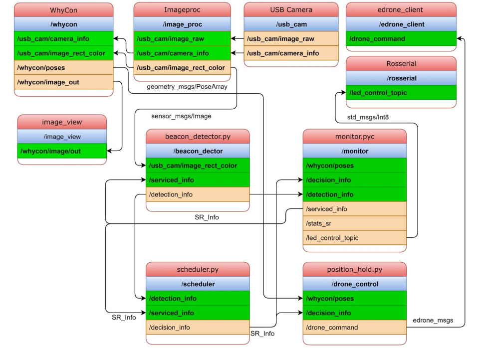
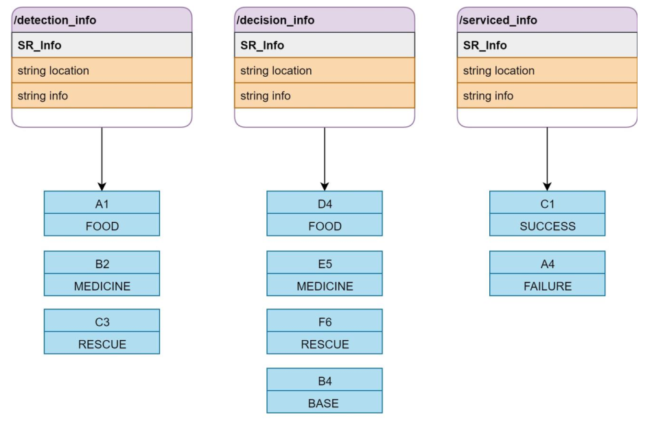

# Survey-and-Rescue-Drone
In this project, we explore an abstracted version of this disaster scenario, using a micro-
quadcopter which operates autonomously to perform search and rescue operations. In the pro-
cess I have learnt concepts in control systems, image processing and algorithm development.

This project is mainly divided into 3 parts:-
1. Color and Position detection of currently active beacons.
2. Scheduling of services offered based on distance and supplies remaining.
3. Path Planning of quadcopter to nearest available active beacon.
4. Traversing the computed by path planning script using PID.

Code and resources for our project Survey and Rescue drone are in the folder.

**GIF of our work done in this project.**

**Flowchart of the communication between different topics and nodes.**

